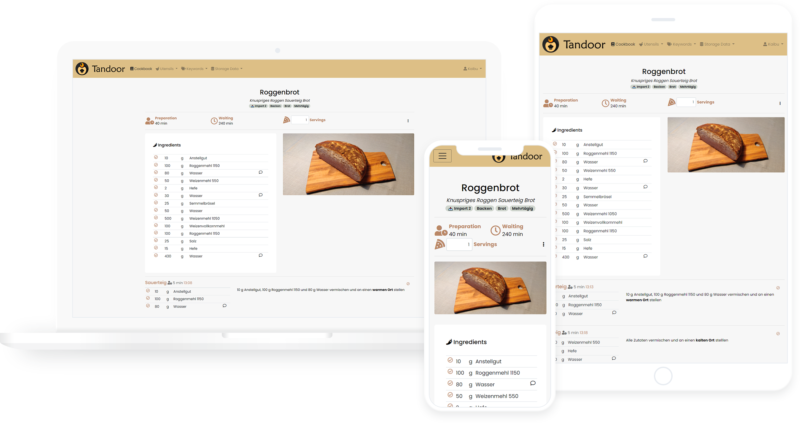

# Getting Started

# Ubuntu Server on FreeNAS VM #

## Step 1 - Setting up Storage ##
First of all, a dedicated storage space will need to be allocated for the virtual machines. You should have already created a storage pool from one or more drives for file-sharing over the network. Add a new Zvol (ZFS volume) to the preferred pool by clicking the vertical ellipsis menu button (⋮).


Specify the size of Zvol, after giving a name to it. Make sure the disk is larger than the minimum requirement of your installed OS. For example, Microsoft Windows 10 and Ubuntu Desktop will need at least 32 GB and 25 GB respectively.


## Step 2 - Setting up VM ##
Go to the “Virtual Machines” section and click “Add” to create a new VM. Use the settings detailed below.

1) Operating System
>* Guest operating system: Linux
>* Name: UBUDocker (or whatever you want it to be)
>* System Clock: Local
>* Boot method: UEFI
>* Start on boot enabled
>* Enable VNC enabled
>* Bind: 0.0.0.0


2) CPU and Memory
>* Virtual CPUs: 2
>* Memory Size: 4 GiB


3) Disks
>- Select "Use existing disk Image"
>  - You will use the Zvol created in Step 1
>- Select Jail_V</UBUDocker


4) Network Interface
>* Adaptor Type: VirtIO


5) Instalation Method
>*Choose instalation media image: Select location of Ubuntu image 
>  */mnt/myVol/ShareDrive/09 - NAS/ubuntu-20.04-desktop-amd64.iso


Pick the “Guest Operating System” as Linux and add a name.
Name the VM and type in a description.
Uncheck the “Start on Boot”, if you want to manually start the VM every time.

## Prerequisites
In order to complete this guide, you should have a fresh Ubuntu 20.04 server instance with a basic firewall and a non-root user with sudo privileges configured. You can learn how to set this up by running through our initial server setup guide.

We will be installing Django within a virtual environment. Installing Django into an environment specific to your project will allow your projects and their requirements to be handled separately.

Once we have our database and application up and running, we will install and configure the Gunicorn application server. This will serve as an interface to our application, translating client requests from HTTP to Python calls that our application can process. We will then set up Nginx in front of Gunicorn to take advantage of its high performance connection handling mechanisms and its easy-to-implement security features.

Let’s get started.

# Docker Install #
## Step 1 — Installing Docker ##
First, update your existing list of packages:
``` 
sudo apt update
 ```
Next, install a few prerequisite packages which let apt use packages over HTTPS:
```
sudo apt install apt-transport-https ca-certificates curl software-properties-common
 ```
Then add the GPG key for the official Docker repository to your system:
```
curl -fsSL https://download.docker.com/linux/ubuntu/gpg | sudo apt-key add -
 ```
Add the Docker repository to APT sources:
```
sudo add-apt-repository "deb [arch=amd64] https://download.docker.com/linux/ubuntu focal stable"
 ```
Next, update the package database with the Docker packages from the newly added repo:
```
sudo apt update
 ```
Make sure you are about to install from the Docker repo instead of the default Ubuntu repo:
```
apt-cache policy docker-ce
```
Finally, install Docker:
```
sudo apt install docker-ce
 ```
Docker should now be installed, the daemon started, and the process enabled to start on boot. Check that it’s running:
```
sudo systemctl status docker
```

## Step 2 — Installing Portainer ##
We now need to create an area for Portainer to have data.
 ```
sudo mkdir /portainer
sudo mkdir /portainer/data
 ```
Now we will do a Docker run Portainer
 ```
sudo docker run -d -p 8000:8000 -p 9000:9000 --name=portainer --restart=always --pull=always -v /var/run/docker.sock:/var/run/docker.sock -v /portainer/data:/data portainer/portainer-ce
 ```
# Manual Install #
### Installing the Packages from the Ubuntu Repositories

To begin the process, we’ll download and install all of the items we need from the Ubuntu repositories. We will use the Python package manager pip to install additional components a bit later.

We need to update the local apt package index and then download and install the packages. The packages we install depend on which version of Python your project will use.
```shell script
$ sudo apt update
$ sudo apt install python3-pip python3-dev libpq-dev postgresql postgresql-contrib nginx curl git
```

## Creating the PostgreSQL Database and User
Log into an interactive Postgres session by typing:

``` shell script
$ sudo -u postgres psql
```
In the psql console:
```
CREATE DATABASE djangodb;
CREATE USER djangouser WITH PASSWORD 'password';
GRANT ALL PRIVILEGES ON DATABASE djangodb TO djangouser;
ALTER DATABASE djangodb OWNER TO djangouser;

--Maybe not necessary, but should be faster:
ALTER ROLE djangouser SET client_encoding TO 'utf8';
ALTER ROLE djangouser SET default_transaction_isolation TO 'read committed';
ALTER ROLE djangouser SET timezone TO 'UTC';

--Grant superuser right to your new user, it will be removed later
ALTER USER djangouser WITH SUPERUSER;
```
When you are finished, exit out of the PostgreSQL prompt by typing:

``` shell script
\q
```

## Creating a Python Virtual Environment for your Project
Now that we have our database, we can begin getting the rest of our project requirements ready. We will be installing our Python requirements within a virtual environment for easier management.

To do this, we first need access to the virtualenv command. We can install this with pip.

If you are using Python 3, upgrade pip and install the package by typing:

``` shell script
$ sudo -H pip3 install --upgrade pip
$ sudo -H pip3 install virtualenv
```
With virtualenv installed, we can start forming our project. Create and move into a directory where we can keep our project files:

``` shell script
$ mkdir ~/recipes
$ cd ~/recipes
```
Within the project directory, create a Python virtual environment by typing:
``` shell script
virtualenv recipesenv
```
This will create a directory called recipesenv within your recipes directory. Inside, it will install a local version of Python and a local version of pip. We can use this to install and configure an isolated Python environment for our project.

Before we install our project’s Python requirements, we need to activate the virtual environment. You can do that by typing:
``` shell script
$ source recipesenv/bin/activate
```
Your prompt should change to indicate that you are now operating within a Python virtual environment. It will look something like this: (recipesenv)user@host:~/recipes$.

*With your virtual environment active, install Django, Gunicorn, and the psycopg2 PostgreSQL adaptor with the local instance of pip:
Note: When the virtual environment is activated (when your prompt has (myprojectenv) preceding it), use pip instead of pip3, even if you are using Python 3. The virtual environment’s copy of the tool is always named pip, regardless of the Python version.*

``` shell script
$ pip install django gunicorn psycopg2-binary
 ```
You should now have all of the software needed to start a Django project.

## Installing Django Project
Get the last version from the repository: 
``` shell script
$ git clone https://github.com/vabene1111/recipes.git -b master
```
Download the .env configuration file and edit it accordingly.
```
wget https://raw.githubusercontent.com/vabene1111/recipes/develop/.env.template -O .env
```
edit .env template line 
Load variables from POSTGRES_HOST=db_recipes to POSTGRES_HOST=localhost

``` shell script
$ export $(cat .env |grep "^[^#]" | xargs) 
```

Execute
```
python3.8 manage.py migrate
```
Log into an interactive Postgres session by typing:
```
sudo -u postgres psql
```
revert superuser from postgres
```
ALTER USER djangouser WITH NOSUPERUSER;
```
Generate static files:
```
python3.8 manage.py collectstatic
```

Test to see everything worked by typing:
``` 
python3.8 manage.py runserver
```


## Creating systemd Socket and Service Files for Gunicorn

The Gunicorn socket will be created at boot and will listen for connections. When a connection occurs, systemd will automatically start the Gunicorn process to handle the connection.

Start by creating and opening a systemd socket file for Gunicorn with sudo privileges:
```
sudo nano /etc/systemd/system/gunicorn.socket
```
Inside, we will create a [Unit] section to describe the socket, a [Socket] section to define the socket location, and an [Install] section to make sure the socket is created at the right time:
```
[Unit]
Description=gunicorn socket

[Socket]
ListenStream=/run/gunicorn.sock

[Install]
WantedBy=sockets.target
```

Next, create and open a systemd service file for Gunicorn with sudo privileges in your text editor. The service filename should match the socket filename with the exception of the extension:
```
sudo nano /etc/systemd/system/gunicorn.service
```

```
[Unit]
Description=gunicorn daemon
Requires=gunicorn.socket
After=network.target

[Service]
User=jcm
Group=www-data
WorkingDirectory=/home/jcm/recipes/recipes
EnvironmentFile=/home/jcm/recipes/recipes/.env
ExecStart=/home/jcm/recipes/recipesenv/bin/gunicorn \
          --access-logfile - \
          --workers 3 \
          --bind unix:/run/gunicorn.sock \
          recipes.wsgi:application

[Install]
WantedBy=multi-user.target
```


We can now start and enable the Gunicorn socket. This will create the socket file at /run/gunicorn.sock now and at boot. When a connection is made to that socket, systemd will automatically start the gunicorn.service to handle it:
```
sudo systemctl start gunicorn.socket
sudo systemctl enable gunicorn.socket
```
Check the status of the process to find out whether it was able to start:
```
sudo systemctl status gunicorn.socket
```
You should receive an output like this:
```
Output
● gunicorn.socket - gunicorn socket
     Loaded: loaded (/etc/systemd/system/gunicorn.socket; enabled; vendor prese>
     Active: active (listening) since Fri 2020-06-26 17:53:10 UTC; 14s ago
   Triggers: ● gunicorn.service
     Listen: /run/gunicorn.sock (Stream)
      Tasks: 0 (limit: 1137)
     Memory: 0B
     CGroup: /system.slice/gunicorn.socket
```
Next, check for the existence of the gunicorn.sock file within the /run directory:
```
$ file /run/gunicorn.sock
```
```
Output
/run/gunicorn.sock: socket
```

Check the Gunicorn socket’s logs by typing:
```
$ sudo journalctl -u gunicorn.socket
```

sudo systemctl daemon-reload
sudo systemctl restart gunicorn


## Configure Nginx to Proxy Pass to Gunicorn
ow that Gunicorn is set up, we need to configure Nginx to pass traffic to the process.

Start by creating and opening a new server block in Nginx’s sites-available directory:

```
sudo nano /etc/nginx/sites-available/recipes
```

```
server {
    listen 8002;

    location = /favicon.ico { access_log off; log_not_found off; }
    location /static {
        alias /home/jcm/recipes/recipes/staticfiles;
    }

    location /media {
        alias /home/jcm/recipes/recipes/mediafiles;
    }
    
    location / {
        include proxy_params;
        proxy_pass http://unix:/run/gunicorn.sock;
    }
}
```
Save and close the file when you are finished. Now, we can enable the file by linking it to the sites-enabled directory:
```
sudo ln -s /etc/nginx/sites-available/recipes /etc/nginx/sites-enabled
```

Test your Nginx configuration for syntax errors by typing:
```
sudo nginx -t
```
If no errors are reported, go ahead and restart Nginx by typing:
```
sudo systemctl restart nginx
```

Finally, we need to open up our firewall to normal traffic on port 80. Since we no longer need access to the development server, we can remove the rule to open port 8000 as well:
```
sudo ufw delete allow 8002
sudo ufw allow 'Nginx Full'
```


Create a service that will start gunicorn at boot:
```
sudo nano /etc/systemd/system/gunicorn_recipes.service
```
And enter these lines:
```
[Unit]
Description=gunicorn daemon for recipes
After=network.target

[Service]
Type=simple
Restart=always
RestartSec=3
Group=www-data
WorkingDirectory=/media/data/recipes
EnvironmentFile=/media/data/recipes/.env
ExecStart=/opt/.pyenv/versions/3.8.5/bin/gunicorn --error-logfile /tmp/gunicorn_err.log --log-level debug --capture-output --bind unix:/media/data/recipes/recipes.sock recipes.wsgi:application

[Install]
WantedBy=multi-user.target
```

sudo systemctl enable gunicorn_recipes.service
sudo systemctl start gunicorn_recipes.service
systemctl status gunicorn_recipes.service


 --error-logfile /tmp/gunicorn_err.log --log-level debug --capture-output --bind unix:/run/guinicorn.sock recipes.wsgi:application


### Resources VM
https://www.digitalocean.com/community/tutorials/how-to-install-and-use-docker-on-ubuntu-20-04

### Creating a Ubuntu VM
- https://www.unbxtech.com/2020/04/howto-create-vm-freenas-11.html
- https://www.youtube.com/watch?v=8oMAEBUOPQ0

### Initial Server Setup with Ubuntu 20.04
https://www.digitalocean.com/community/tutorials/initial-server-setup-with-ubuntu-20-04

### How To Set Up Django with Postgres, Nginx, and Gunicorn on Ubuntu 20.04
https://www.digitalocean.com/community/tutorials/how-to-set-up-django-with-postgres-nginx-and-gunicorn-on-ubuntu-20-04

**Installing the Packages from the Ubuntu Repositories**


sudo -u postgres psql


iocage setup
New Jail
DCHP

 create a dataset in the FreeNAS WebUI where you'll store the app
mkdir /mnt/myVol/apps/recipes/postgresql/

mount dataset 
iocage fstab -a postgresql /mnt/Data/apps/postgresql /mnt/postgres/data nullfs rw 0 0

The first thing you need to do is to update and upgrade packages:
pkg update
pkg upgrade

*Install Packages*
pkg install sudo
pkg install git
pkg install python38

*Install Pip*
curl https://bootstrap.pypa.io/get-pip.py -o get-pip.py
python3.8 get-pip.py

*Upgrading PIP*
python -m pip install -U pip

*Install PostgreSQL*
pkg install postgresql12-server

#autostart service with jail
sysrc postgresql_enable=YES

sudo pip install -r requirements.txt

pip install cryptography-2.8-cp38-cp38-win_amd64 (1)


Get the last version from the repository:
git clone https://github.com/vabene1111/recipes.git -b master


<h1 align="center">
  <br>
  <a href="https://app.tandoor.dev"></a>
  <br>
  Tandoor Recipes
  <br>
</h1>

<h4 align="center">The recipe manager that allows you to manage your ever growing collection of digital recipes.</h4>

<p align="center">


</p>

<p align="center">
<a href="https://docs.tandoor.dev/install/docker/" target="_blank" rel="noopener noreferrer">Installation</a> •
<a href="https://docs.tandoor.dev/" target="_blank" rel="noopener noreferrer">Documentation</a> •
<a href="https://app.tandoor.dev/" target="_blank" rel="noopener noreferrer">Demo</a>
</p>



# Your Feedback

Share some information on how you use Tandoor to help me improve the application [Google Survey](https://forms.gle/qNfLK2tWTeWHe9Qd7)

## Features

- 📦 **Sync** files with Dropbox and Nextcloud (more can easily be added)
- 🔍 Powerful **search** with Djangos [TrigramSimilarity](https://docs.djangoproject.com/en/3.0/ref/contrib/postgres/search/#trigram-similarity)
- 🏷️ Create and search for **tags**, assign them in batch to all files matching certain filters
- 📄 **Create recipes** locally within a nice, standardized web interface
- ⬇️ **Import recipes** from thousands of websites supporting [ld+json or microdata](https://schema.org/Recipe)
- 📱 Optimized for use on **mobile** devices like phones and tablets
- 🛒 Generate **shopping** lists from recipes
- 📆 Create a **Plan** on what to eat when
- 👪 **Share** recipes with friends and comment on them to suggest or remember changes you made
- ➗ automatically convert decimal units to **fractions** for those who like this
- 🐳 Easy setup with **Docker** and included examples for Kubernetes, Unraid and Synology
- 🎨 Customize your interface with **themes**
- ✉️ Export and import recipes from other users
- 🌍 localized in many languages thanks to the awesome community
- ➕ Many more like recipe scaling, image compression, cookbooks, printing views, ...

This application is meant for people with a collection of recipes they want to share with family and friends or simply
store them in a nicely organized way. A basic permission system exists but this application is not meant to be run as 
a public page.
Documentation can be found [here](https://docs.tandoor.dev/).

While this application has been around for a while and is actively used by many (including myself), it is still considered
**beta** software that has a lot of rough edges and unpolished parts.
## License

Beginning with version 0.10.0 the code in this repository is licensed under the [GNU AGPL v3](https://www.gnu.org/licenses/agpl-3.0.de.html) license with an
[common clause](https://commonsclause.com/) selling exception. See [LICENSE.md](https://github.com/vabene1111/recipes/blob/develop/LICENSE.md) for details.

> NOTE: There appears to be a whole range of legal issues with licensing anything else then the standard completely open licenses.
> I am in the process of getting some professional legal advice to sort out these issues. 
> Please also see [Issue 238](https://github.com/vabene1111/recipes/issues/238) for some discussion and **reasoning** regarding the topic.

**Reasoning**  
**This software and *all* its features are and will always be free for everyone to use and enjoy.**

The reason for the selling exception is that a significant amount of time was spend over multiple years to develop this software.
A payed hosted version which will be identical in features and code base to the software offered in this repository will
likely be released in the future (including all features needed to sell a hosted version as they might also be useful for personal use).
This will not only benefit me personally but also everyone who self-hosts this software as any profits made trough selling the hosted option
allow me to spend more time developing and improving the software for everyone. Selling exceptions are [approved by Richard Stallman](http://www.gnu.org/philosophy/selling-exceptions.en.html) and the
common clause license is very permissive (see the [FAQ](https://commonsclause.com/)).
